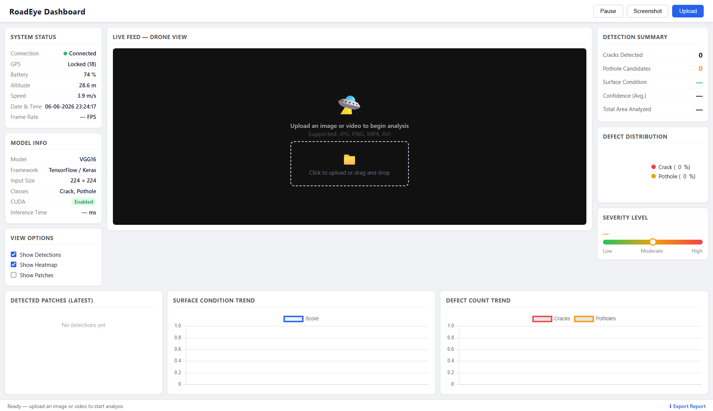
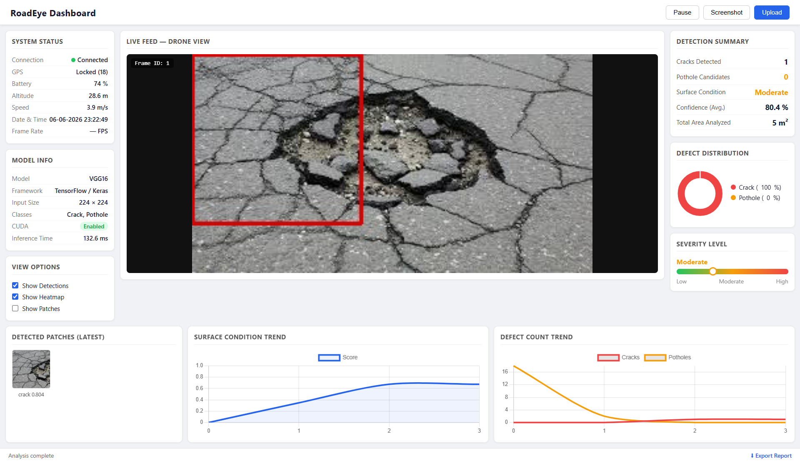
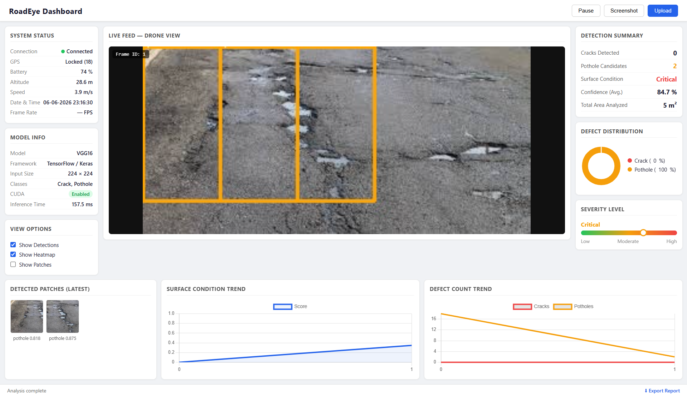

# Intelligent RoadEye — Road Surface Defect Detection


> Upload a road image or video. Get real-time crack and pothole detection with a live analysis dashboard — severity scoring, defect distribution and trend charts.

Originally built for the Amaravati Drone Summit 2024 *(2nd Runner-up)*. Rebuilt from scratch in June 2026 with a properly merged and balanced dataset, PyTorch GPU training and a fully redesigned real-time dashboard.

---

## Screenshots

| Dashboard Overview | Crack Detection |
|---|---|
|  |  |

| Pothole Detection | Detection Summary |
|---|---|
|  |  |

---

## What It Does

- ✅ VGG16 fine-tuned on a custom merged road defect dataset — 82.2% validation accuracy
- ✅ Sliding window inference — 128×128 patches with 50% overlap across full frames
- ✅ Real-time detection dashboard — live bounding boxes, detection summary, severity meter
- ✅ Defect distribution donut chart — crack vs pothole breakdown
- ✅ Surface condition trend and defect count trend charts
- ✅ Detected patch thumbnails — shows the actual regions flagged
- ✅ Supports both image upload and video feed
- ✅ Export report as JSON
- ✅ GPU-accelerated inference (CUDA) — 130-160ms per frame on RTX 3050

---

## How It Works

**Dataset preparation**
Two Kaggle road defect datasets merged and balanced using `model/merge_dataset.py`. Original data had a severe class imbalance — 162 crack images vs 2,712 pothole images. Fixed by augmenting crack images to 800 using 8 augmentation strategies (flips, rotations, brightness shifts) and randomly sampling 800 pothole images. Final dataset: 800 crack + 800 pothole = 1,600 balanced images.

**Model**
VGG16 pretrained on ImageNet, fine-tuned with last 8 layers unfrozen. Added AdaptiveAvgPool2d to handle flexible input sizes, followed by a custom classifier head (512 → 256 → 128 → 2). Trained with mixed precision (float16) on NVIDIA RTX 3050 4GB — completed in 4.9 minutes.

**Inference**
Sliding window scans the uploaded image in 128×128 patches with 64-pixel stride. Each patch is classified independently. Detections above 75% confidence are drawn as bounding boxes. Surface condition severity is computed from defect area ratio.

---

## Model

| Detail | Value |
|---|---|
| Architecture | VGG16 (Transfer Learning) |
| Framework | PyTorch 2.7 |
| Input Size | 128 × 128 |
| Classes | Crack, Pothole |
| Val Accuracy | 82.2% |
| Crack Recall | 94% |
| Pothole Precision | 92% |
| Training Time | 4.9 minutes (RTX 3050) |
| Inference | ~130-160ms per image |

---

## Dataset

Both datasets are from Kaggle — not included in this repo due to size (~2GB combined). Download and place as described below before training.

**Dataset 1** — [Potholes or Cracks on Road Image Dataset](https://www.kaggle.com/datasets/dataclusterlabs/potholes-or-cracks-on-road-image-dataset)
→ Place in: `data/raw/Potholes or Cracks on Road Image Dataset/`

**Dataset 2** — [Potholes, Cracks and Open Manholes](https://www.kaggle.com/datasets/sabidrahman/pothole-cracks-and-openmanhole)
→ Place in: `data/raw/potholes, cracks and openmanholes (Road Hazards)/`

Run `python model/merge_dataset.py` to merge, balance and augment automatically.

---

## Running It

```bash
# Clone and setup
git clone https://github.com/sagar4458/intelligent-roadeye.git
cd intelligent_roadeye
python -m venv venv
venv\Scripts\activate
pip install -r backend/requirements.txt

# Download datasets from Kaggle links above
# Place in data/raw/ as described

# Merge and balance datasets
python model/merge_dataset.py

# Train model (~5 mins on GPU)
python model/train.py

# Run dashboard
python backend/app.py
```

Open `http://localhost:5000`

---

## Project Structure

```
intelligent_roadeye/
├── backend/
│   ├── app.py              # Flask backend
│   └── requirements.txt
├── model/
│   ├── merge_dataset.py    # Dataset merger + balancer
│   ├── train.py            # VGG16 training pipeline
│   └── predict.py          # Inference engine
├── frontend/
│   └── index.html          # Dashboard UI
├── data/                   # Not in repo — download datasets
├── screenshots/
├── README.md
└── ROADMAP.md
```

---

## Stack

`Python` `PyTorch` `TorchVision` `VGG16` `OpenCV` `Flask` `CUDA` `NumPy` `scikit-learn` `Matplotlib` `Chart.js`

---

## Limitations

The 82.2% accuracy reflects the current balanced dataset size (1,600 images). A larger and more diverse road dataset would push this higher. The sliding window approach works well for close-up road images — aerial drone footage with mixed backgrounds (vegetation, vehicles) can reduce precision. The next version will address this with a larger dataset and a dedicated road region detector.

---

## Roadmap

See [ROADMAP.md](ROADMAP.md)

---

*Originally developed: October 2024 — Rebuilt and open-sourced: June 2026*